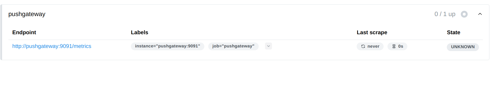
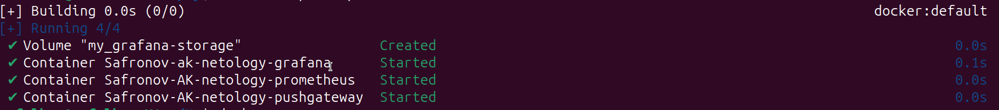
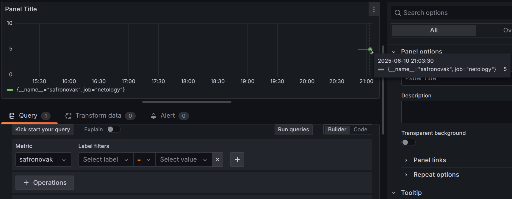
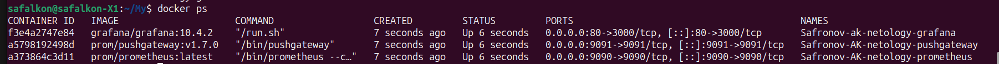
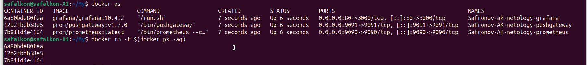

# Домашнее задание к занятию "`Docker. Часть 2`" - `Сафронов Алексей`


### Задание 1

Не могу сказать что docker compose изменит лично мою жизнь, но если начну пользоваться docker'ом то явно с помощью compose

---

### Задание 2
```
volumes:

  prometheus-data:

networks:
  Safronov-AK-my-netology-hw:
    driver: bridge
    ipam:
      config:
        - subnet: 10.5.0.0/16
          gateway: 10.5.0.1

services:
  prometheus:
    image: "prom/prometheus:latest"
    container_name: "Safronov-AK-netology-prometheus"
    command: "--config.file=/etc/prometheus/prometheus.yml"
    restart: "unless-stopped"
    ports:
      - "9090:9090" 
    volumes:
      - ./prometheus-data:/prometheus 
      - ./prometheus/prometheus.yml:/etc/prometheus/prometheus.yml 
    networks:
      - Safronov-AK-my-netology-hw


```


---

### Задание 4

```
volumes:

  prometheus-data:

networks:
  Safronov-AK-my-netology-hw:
    driver: bridge
    ipam:
      config:
        - subnet: 10.5.0.0/16
          gateway: 10.5.0.1

services:
  prometheus:
    image: "prom/prometheus:latest"
    container_name: "Safronov-AK-netology-prometheus"
    command: "--config.file=/etc/prometheus/prometheus.yml"
    restart: "unless-stopped"
    ports:
      - "9090:9090" 
    volumes:
      - ./prometheus-data:/prometheus 
      - ./prometheus/prometheus.yml:/etc/prometheus/prometheus.yml 
    networks:
      - Safronov-AK-my-netology-hw
  pushgateway:
    image: prom/pushgateway:v1.7.0
    container_name: Safronov-AK-netology-pushgateway
    restart: unless-stopped
    ports:
      - "9091:9091" 
    networks:
      - Safronov-AK-my-netology-hw
```


---

### Задание 4




---

### Задание 5




---

### Задание 7

[docker-compose.yml](https://github.com/Safalkon/hw6.04/blob/main/docker-compose.yml)





---

### Задание 8



---
